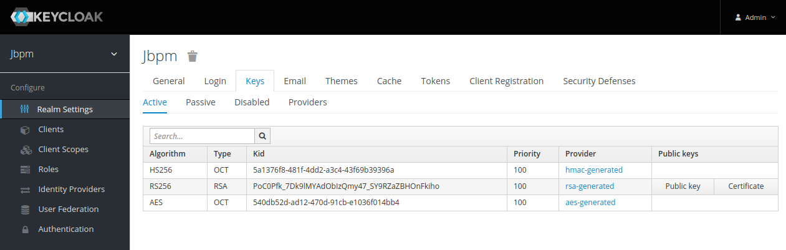

# Integration between JBPM and keycloak

## Prerequisites

1. A working keycloak installation with admin access
2. Some patience and :coffee:

## References

- [JBPM's Keycloak SSO integration](https://docs.jboss.org/jbpm/release/7.31.0.Final/jbpm-docs/html_single/#_kie.keycloakssointegration)
- [Uberfire security management](https://github.com/kiegroup/appformer/tree/master/uberfire-extensions/uberfire-security/uberfire-security-management/uberfire-security-management-keycloak)
- [Secure spring-boot 2 using Keycloak](https://medium.com/keycloak/secure-spring-boot-2-using-keycloak-f755bc255b68)


## Steps

### Keycloak

Inside keycloak, create a new realm. Call it as you want. In our demo, we'll use a realm called "jbpm".

I've written another [README.md](https://github.com/d4rkstar/kong-konga-keycloak#5-keycloak-containers) on keycloak: you may find useful start from a docker image. 

### KIE

- download a business application stub from https://start.jbpm.org. Then unzip the folder. 

```bash
$ unzip business-application.zip -d bapp
```

:point_right: [Further informartions here](https://docs.jboss.org/jbpm/release/7.31.0.Final/jbpm-docs/html_single/#_create_your_business_application) :point_left:

You'll end with three folders:

- *business-application-kjar* - the process
- *business-application-model* - model and shared data
- *business-application-service* - the kie server service

Keycloak integration is achieved changing some things inside the service as described [here](https://docs.jboss.org/jbpm/release/7.31.0.Final/jbpm-docs/html_single/#_use_keycloak_as_authentication_provider).

In particular:

1. Configure the keycloak client and do the other things related to keycloak
2. Configure the pom.xml adding dependencies. Mine is like this:

```xml
[...]

<parent>
    <groupId>org.springframework.boot</groupId>
    <artifactId>spring-boot-starter-parent</artifactId>
    <version>2.1.1.RELEASE</version>
  </parent>

  <properties>
    <version.org.kie>7.30.0.Final</version.org.kie>
    <version.org.keycloak>8.0.1</version.org.keycloak>
    <maven.compiler.target>1.8</maven.compiler.target>
    <maven.compiler.source>1.8</maven.compiler.source>
    <project.build.sourceEncoding>UTF-8</project.build.sourceEncoding>
    <project.reporting.outputEncoding>UTF-8</project.reporting.outputEncoding>
    <narayana.version>5.9.0.Final</narayana.version>
    <fabric8.version>3.5.40</fabric8.version>
  </properties>

  <dependencies>
    <dependency>
        <groupId>org.kie</groupId>
        <artifactId>kie-server-spring-boot-starter</artifactId>
        <version>${version.org.kie}</version>
    </dependency>

    <dependency>
      <groupId>org.springframework.boot</groupId>
      <artifactId>spring-boot-starter-test</artifactId>
      <scope>test</scope>
    </dependency>

    <dependency>
      <groupId>org.keycloak</groupId>
      <artifactId>keycloak-spring-boot-starter</artifactId>
    </dependency>
  </dependencies>

  <dependencyManagement>
    <dependencies>
      <dependency>
        <groupId>org.keycloak.bom</groupId>
        <artifactId>keycloak-adapter-bom</artifactId>
        <version>${version.org.keycloak}</version>
        <type>pom</type>
        <scope>import</scope>
      </dependency>

    </dependencies>
  </dependencyManagement>

  <build>
  [....]
```

3. Configure the application.properties file inside the file ```bapp/business-application-service/src/main/resources/application.properties```. This file is named "-dev.properties" for the dev environment (when running launch-dev.sh or java -jar -Dspring.profiles.active=dev -jar jarname).

Significative part of the configuration are:

:warning: *Attention* :warning:
The business-application-service come pre-configured to run standalone (without a controller) in production mode. While in dev mode the configuration has the ``kieserver.controllers`` parameter filled in. So, if you're using the kieserver through a controller (like our case with Business Central):
```
#kie server config
kieserver.serverId=business-application-service-dev-bs
kieserver.serverName=business-application-service Dev BS
kieserver.location=http://localhost:8090/rest/server
kieserver.controllers=http://localhost:8080/business-central/rest/controller
```

This part is for keycloak
```
# keycloak security setup
keycloak.auth-server-url=http://keycloak-public-url-or-ip:8180/auth
keycloak.realm=jbpm
keycloak.resource=springboot-app
keycloak.public-client=true
keycloak.principal-attribute=preferred_username
keycloak.enable-basic-auth=true
```

in my environment, keycloak runs inside a docker container and is exposed on port 8180. *You may need to change* the host:port setup of ``keycloak.auth-server-url``. 

4. We need to change some java code inside the service. In particular, we need to change the [```DefaultWebSecurityConfig.java```](https://gist.github.com/d4rkstar/2f036294aa20612ba7a3e6c888e87ca4#file-defaultwebsecurityconfig-java) inside the ```src/main/java/com/company/service``` folder and add the file. In the same folder we need to add the file [```CustomKeycloakSpringBootConfigResolver.java```](https://gist.github.com/d4rkstar/2f036294aa20612ba7a3e6c888e87ca4#file-customkeycloakspringbootconfigresolver-java) 
:point_right:[reference here](https://medium.com/keycloak/secure-spring-boot-2-using-keycloak-f755bc255b68):point_left:

You can find both file on this [Public Gist](https://gist.github.com/d4rkstar/2f036294aa20612ba7a3e6c888e87ca4)


Usually, the controller (the business-central application in our case) requires credentials on the ```rest/controller``` endpoint. Defaults credentials used by uberfire security client are kieserver/kieserver1! 

To change these credentials, we need to start our kie server passing user/pwd (look inside [Jboss Doc chapter 22, table 22.1](https://docs.jboss.org/drools/release/6.4.0.CR2/drools-docs/html/ch22.html)):

- org.kie.server.controller.user - string (default is "kieserver") Username used to connect to the controller REST api
- org.kie.server.controller.pwd - string (default is "kieserver1!") Password used to connect to the controller REST api

We can change these in two ways:

1. from command line, passing in parameters to the jar file:

```bash
$ java -Dspring.profiles.active=dev -Dorg.kie.server.controller.user=kieserver -Dorg.kie.server.controller.pwd=kieserver -jar target/business-application-service-1.0-SNAPSHOT.jar
```

2. configuring the ```business-application-service.xml``` (or the dev file) in the root of the "business-application-service" sources. Ex.

```xml
<kie-server-state>
  <controllers>
    <string>http://localhost:8080/business-central/rest/controller</string>
  </controllers>
  <configuration>
    <configItems>
      <config-item>
        <name>org.kie.server.controller.user</name>
        <value>kieserver</value>
        <type>java.lang.String</type>
      </config-item>
      <config-item>
        <name>org.kie.server.controller.pwd</name>
        <value>kieserver1!</value>
        <type>java.lang.String</type>
      </config-item>
      <config-item>
        <name>org.kie.server.location</name>
        <value>http://localhost:8090/rest/server</value>
        <type>java.lang.String</type>
      </config-item>
      <config-item>
        <name>org.kie.server.id</name>
        <value>business-application-service-dev</value>
        <type>java.lang.String</type>
      </config-item>
      <config-item>
        <name>org.kie.server.controller</name>
        <value>http://localhost:8080/business-central/rest/controller</value>
        <type>java.lang.String</type>
      </config-item>
    </configItems>
  </configuration>
  <containers/>
</kie-server-state>
```

### JBPM Downloads

- download jbpm from https://jbpm.org. actual release is 7.31.0.Final

```bash
$ wget https://download.jboss.org/jbpm/release/7.31.0.Final/jbpm-server-7.31.0.Final-dist.zip
```

- unzip the archive to a predefined folder:

```bash
$ unzip jbpm-server-7.31.0.Final-dist.zip -d jbpm 
```

- go inside the folder ```jbpm/standalone/deployments``` and remove the following jar files:

```bash
$ cd jbpm/standalone/deployments
$ rm -rf kie-server.war*
$ rm -rf jbpm-casemgmt.war*
```

you should end with a directory with the only Business Central war file inside.

The reason for this is simple: we will enable keycloak authentication inside the Business Central but this is not supported for jbpm-casemgmt.war (sample case management) and kie-server.war (sample kie server).

As per [JBPM Documentation 12.3.9](https://docs.jboss.org/jbpm/release/7.31.0.Final/jbpm-docs/html_single/#_keycloak_and_the_business_centrals_security_administration_area), the application’s security management system points to the application’s server realm: it points to the Wildfly’s ApplicationRealm (properties based). It means the entities from the realm presented in the administration area are not the ones from the Keycloak realm. To Use the built-in Keycloak security management provider instead of the default one, the only way is to customize the jBPM application (WAR file).

This step is closely related to the modification of the wildfly server: after modifying the business-central war file, the latter will use the session token to query the keycloak. So a change in the security of wildfly is necessary to make sure that the login phase also passes from keycloak.

In order to modify the business central .war file, we need to follow these steps:

1. Stop the jboss server

2. Create a temp folder, copy the business-central war file to temp folder, unpack it and remove the war file:
    
    ```bash
    ~/jbpm $ mkdir /tmp/jbpm-modification
    ~/jbpm $ cp standalone/deployments/business-central.war /tmp/jbpm-modification
    ~/jbpm $ cd /tmp/jbpm-modification
    /tmp/jbpm-modification $ jar xf business-central.war
    /tmp/jbpm-modification $ rm business-central.war
    ```
    
3. Edit the ``WEB-INF/classes/security-management.properties`` as described in [jBPM documentation](https://docs.jboss.org/jbpm/release/7.31.0.Final/jbpm-docs/html_single/#_keycloak_and_the_business_centrals_security_administration_area), removing the ``org.uberfire.ext.security.management.api.userManagementServices=WildflyCLIUserManagementService`` setting and replacing it as follow:
    
    ```ini
    org.uberfire.ext.security.management.api.userManagementServices=KCAdapterUserManagementService
    org.uberfire.ext.security.management.keycloak.authServer=http://keycloak-public-url-or-ip:8180/auth    
    ```

4. Repackage the jar file, replace it inside Jboss and cleanup:

    ```bash
    /tmp/jbpm-modification $ jar cf ../business-central.war *
    /tmp/jbpm-modification $ mv ../business-central.war ~/jbpm/standalone/deployments/business-central.war 
    /tmp/jbpm-modification $ cd /tmp
    /tmp $ rm -rf /tmp/jbpm-modification 
    /tmp $ cd ~/jbpm
    ```

Now we need to change Wildfly security. I found that the official jBPM documentation is a bit neglected on this point: at the [12.3.4.1 paragraph](https://docs.jboss.org/jbpm/release/7.31.0.Final/jbpm-docs/html_single/#_install_the_kc_adapter) the steps are unclear and the command ``./jboss-cli.sh -c --file=adapter-install.cli`` has some grey text that can lead in error :confounded:. Furthermore there's no link to [Keycloak documentation](https://www.keycloak.org/docs/latest/securing_apps/index.html#jboss-eap-wildfly-adapter) that suggest a newest way to install the keycloak adapter for Wildfly 11 and there are two ways (for the case that jboss is running and the case that jboss is not running) :disappointed::disappointed:


So the best bet is to follow Keycloak guide:

1. At the moment i'm writing, the jBPM is running on Wildfly 14, so let's download the client and follow the instruction for this release inside the jBPM folder:
    
    ```bash
    ~ $ cd  ~/jbpm
    ~/jbpm $ wget https://downloads.jboss.org/keycloak/8.0.1/adapters/keycloak-oidc/keycloak-wildfly-adapter-dist-8.0.1.zip
    ```
2. Unpack the zip:
    ```bash
    ~/jbpm $ unzip keycloak-wildfly-adapter-dist-8.0.1.zip
    ```
3. Install the adapter inside wildfly:
    ```bash
    ~/jbpm $ ./bin/jboss-cli.sh --file=bin/adapter-elytron-install-offline.cli
    ```
4. We need to enable the Keycloak adapter for business central inside the wildfly configuration file.

    For this purpose, edit the wildfly configuration file (inside the JBOSS_HOME/standalone/configuration/standalone.xml or standalone-full.xml).
    For the differences between various configuration files, look at this [StackOverflow answer](https://stackoverflow.com/questions/19524364/difference-between-standalone-xml-and-standalone-full-xml).
    
    Before to proceed into the configuration, we need to get some informations from Keycloak. So go to Keycloak master console, select the realm and then go into "Realm Settings" > "Keys" tab. Search for RS256,c lick on "Public key" button and copy the value from the popup. This will be the REALM_PUBLIC_KEY we'll use in the keycloak subsystem.
    
    
    
    
    Inside the configuration file, please look for this subsystem:
    
    ```xml
    <subsystem xmlns="urn:jboss:domain:keycloak:1.1"/>
    ```
    
    we need to change this into:
    
    ```xml
    <subsystem xmlns="urn:jboss:domain:keycloak:1.1">
      <secure-deployment name="business-central.war">
        <realm>jbpm</realm>
        <realm-public-key>REALM_PUBLIC_KEY</realm-public-key>
        <auth-server-url>http://keycloak-public-url-or-ip:8180/auth</auth-server-url>
        <ssl-required>external</ssl-required>
        <resource>CLIENT_NAME</resource>
        <enable-basic-auth>true</enable-basic-auth>
        <credential name="secret">CLIENT_SECRET</credential>
        <principal-attribute>preferred_username</principal-attribute>
      </secure-deployment>
    </subsystem>
    ```


